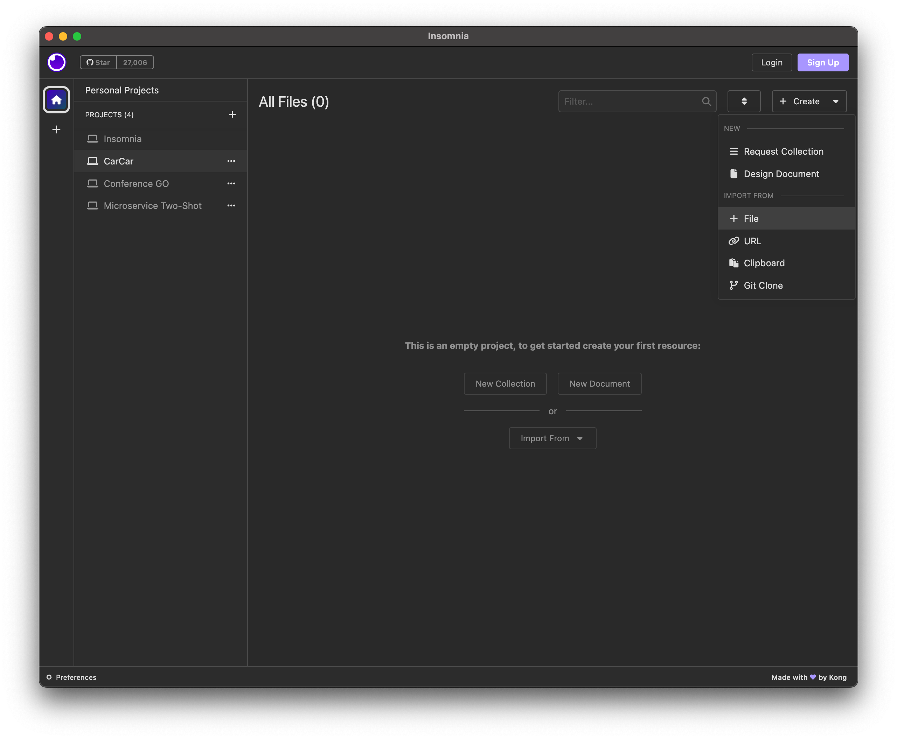

# CarCar

Team: 1

* Shayne Buac - Sales microservice
* Jordan Bott - Service Microservice

## Table of Contents
- [Design](#design)
- [Installation](#installation)
- [Inventory Microservice](#inventory-microservice)
- [Service Microservice](#service-microservice)
- [Sales Microservice](#sales-microservice)

## Design
CarCar is a Web application that is designed to manage an automobile dealership by tracking the inventory, sales, and service of cars. The application consists of 3 microservices: inventory, sales, and service. These microservices utilize RESTful API in the back-end that is then brought to the user interface on the front-end to dynamically display data and allow user interaction with the application. Both the sales and service microservices have their own Automobile value object (`AutomobileVO`), which is created and updated through their own poll microservice that requests and gets `Automobile` data from the Inventory.

Docker is used to run the application. To use the app, follow the steps for the installation below and refer to each microservice's section as needed.

<details><summary><strong>Context Map</strong></summary>

</details>

<details><summary><strong>Route Diagram</strong></summary>

</details>

## Installation
1. Open up your terminal to the desired directory on your local computer
2. Clone the repository
```
git clone https://gitlab.com/jordan.bott/project-beta.git
```
3. Open up Docker Desktop and run the following commands in your terminal:
```
docker volume create beta-data
docker-compose build
docker-compose up
```
**Note:** When you run `docker-compose up` and if you're on macOS, you will see a warning about an environment variable named OS being missing. **You can safely ignore this.**

4. After Docker is done loading, access the application on your browser (Google Chrome recommended) at http://localhost:3000/
5. (Optional) To import a complete Insomnia collection for this project, open Insomnia and within Insomnia:
- Make a new project called CarCar
- Within that project, click the Create dropdown at the top right and click File under IMPORT FROM
	<details><summary>Screenshot</summary>
		
	</details>
- Select the Insomnia.yaml file from the project-beta folder and import
	<details><summary>Screenshot</summary>
		
	</details>
- A new collection called **Shayne/Jordan CarCar** should show up, and that should contain **all of the RESTful API URLs and example inputs** to use for each microservice!

## Disclaimer
This application loads with an empty database. To fully interact with this application, please create **at least one** of the following in this order:
1. [Manufacturer](http://localhost:3000/inventory/manufacturers/new)
2. [Vehicle model](http://localhost:3000/inventory/models/new)
3. [Automobile](http://localhost:3000/inventory/automobiles/new)
4. [Sales person](http://localhost:3000/sales/salesperson/new)
5. [Customers](http://localhost:3000/sales/customers/new)
6. [Sale](http://localhost:3000/sales/new)
7. [Technician](http://localhost:3000/service/technicians/new)
8. [Appointment](http://localhost:3000/service/appointments/new)

## Inventory Microservice
### Overview
The Inventory microservice consists of one main microservice, **api**, and represents the dealership's inventory of vehicles. 

Api is a Django application with a Django project, `inventory_project`, and a Django app, `inventory_rest`, where the latter handles create, read, update, and delete (CRUD) functionality for manufacturers (`Manufacturer` objects), vehicle models (`VehicleModel` objects), and automobiles (`Automobile` objects).

### Models
`Manufacturer`
- name

`VehicleModel`
- name
- picture_url
- manufacturer (ForeignKey to `Manufacturer`)

`Automobile`
- color
- year
- vin
- model (ForeignKey to `VehicleModel`)


### RESTful API (Port 8100)
#### Manufacturer
| Method | URL | Action | View |
| ------ | ------ | ------ | ------ |
| GET | `http://localhost:8100/api/manufacturers/` | List all manufacturers | `api_manufacturers` |
| POST | `http://localhost:8100/api/manufacturers/` | Create a manufacturer | `api_manufacturers` |
| GET | `http://localhost:8100/api/manufacturers/<id>/` | Show a manufacturer's details | `api_manufacturer` |
| PUT | `http://localhost:8100/api/manufacturers/<id>/` | Update a manufacturer | `api_manufacturer` |
| DELETE | `http://localhost:8100/api/manufacturers/<id>/` | Delete a manufacturer | `api_manufacturer` |

<details>
<summary><strong>Example GET Outputs</strong></summary>

##### List all manufacturers:
```
{
	"manufacturers": [
		{
			"href": "/api/manufacturers/1/",
			"id": 1,
			"name": "Chrysler"
		}
	]
}
```
##### Show a manufacturer's details:
```
{
	"href": "/api/manufacturers/1/",
	"id": 1,
	"name": "Chrysler"
}
```
</details>

<details>
<summary><strong>Example POST and PUT Input and Output</strong></summary>

##### Input:
```
{
  "name": "Chrysler"
}
```

##### Output:
```
{
	"href": "/api/manufacturers/1/",
	"id": 1,
	"name": "Chrysler"
}
```

</details>

<details><summary><strong>Example DELETE Output</strong></summary>
<br>

```
{
	"id": null,
	"name": "Chrysler"
}
```
</details>


#### Vehicle Model
| Method | URL | Action | View |
| ------ | ------ | ------ | ------ |
| GET | `http://localhost:8100/api/models/` | List all vehicle models | `api_vehicle_models` |
| POST | `http://localhost:8100/api/models/` | Create a vehicle model | `api_vehicle_models` |
| GET | `http://localhost:8100/api/models/<id>/` | Show a vehicle model's details | `api_vehicle_model` |
| PUT | `http://localhost:8100/api/models/<id>/` | Update a vehicle model | `api_vehicle_model` |
| DELETE | `http://localhost:8100/api/models/<id>/` | Delete a vehicle model | `api_vehicle_model` |

<details>
<summary><strong>Example GET Outputs</strong></summary>

##### List all vehicle models:
```
{
	"models": [
		{
			"href": "/api/models/1/",
			"id": 1,
			"name": "Sebring",
			"picture_url": "https://upload.wikimedia.org/wikipedia/commons/thumb/7/71/Chrysler_Sebring_front_20090302.jpg/320px-Chrysler_Sebring_front_20090302.jpg",
			"manufacturer": {
				"href": "/api/manufacturers/2/",
				"id": 2,
				"name": "Chrysler"
			}
		}
	]
}
```
##### Show a vehicle model's details:
```
{
	"href": "/api/models/1/",
	"id": 1,
	"name": "Sebring",
	"picture_url": "https://upload.wikimedia.org/wikipedia/commons/thumb/7/71/Chrysler_Sebring_front_20090302.jpg/320px-Chrysler_Sebring_front_20090302.jpg",
	"manufacturer": {
		"href": "/api/manufacturers/2/",
		"id": 2,
		"name": "Chrysler"
	}
}
```
</details>

<details>
<summary><strong>Example POST and PUT Input and Output</strong></summary>

##### Input:
```
{
  "name": "Sebring",
  "picture_url": "https://upload.wikimedia.org/wikipedia/commons/thumb/7/71/Chrysler_Sebring_front_20090302.jpg/320px-Chrysler_Sebring_front_20090302.jpg",
  "manufacturer_id": 2
}
```

##### Output:
```
{
	"href": "/api/models/1/",
	"id": 1,
	"name": "Sebring",
	"picture_url": "https://upload.wikimedia.org/wikipedia/commons/thumb/7/71/Chrysler_Sebring_front_20090302.jpg/320px-Chrysler_Sebring_front_20090302.jpg",
	"manufacturer": {
		"href": "/api/manufacturers/2/",
		"id": 2,
		"name": "Chrysler"
	}
}
```

</details>

<details><summary><strong>Example DELETE Output</strong></summary>
<br>

```
{
	"id": null,
	"name": "Pacifica",
	"picture_url": "https://www.motortrend.com/uploads/2021/11/2022-Chrysler-Pacifica-029.jpg",
	"manufacturer": {
		"href": "/api/manufacturers/2/",
		"id": 2,
		"name": "Chrysler"
	}
}
```
</details>

#### Automobile
| Method | URL | Action | View |
| ------ | ------ | ------ | ------ |
| GET | `http://localhost:8100/api/automobiles/` | List all automobiles | `api_automobiles` |
| POST | `http://localhost:8100/api/automobiles/` | Create an automobile | `api_automobiles` |
| GET | `http://localhost:8100/api/automobiles/<vin>/` | Show an automobile's details | `api_automobile` |
| PUT | `http://localhost:8100/api/automobiles/<vin>/` | Update an automobile | `api_automobile` |
| DELETE | `http://localhost:8100/api/automobiles/<vin>/` | Delete an automobile | `api_automobile` |

<details>
<summary><strong>Example GET Outputs</strong></summary>

##### List all automobiles:
```
{
	"autos": [
		{
			"href": "/api/automobiles/J098DFASJ90/",
			"id": 1,
			"color": "Red",
			"year": 2012,
			"vin": "J098DFASJ90",
			"model": {
				"href": "/api/models/2/",
				"id": 2,
				"name": "Sebring",
				"picture_url": "https://upload.wikimedia.org/wikipedia/commons/thumb/7/71/Chrysler_Sebring_front_20090302.jpg/320px-Chrysler_Sebring_front_20090302.jpg",
				"manufacturer": {
					"href": "/api/manufacturers/2/",
					"id": 2,
					"name": "Chrysler"
				}
			}
		}
	]
}
```
##### Show an automobile's details:
```
{
	"href": "/api/automobiles/J098DFASJ90/",
	"id": 1,
	"color": "Red",
	"year": 2012,
	"vin": "J098DFASJ90",
	"model": {
		"href": "/api/models/2/",
		"id": 2,
		"name": "Sebring",
		"picture_url": "https://upload.wikimedia.org/wikipedia/commons/thumb/7/71/Chrysler_Sebring_front_20090302.jpg/320px-Chrysler_Sebring_front_20090302.jpg",
		"manufacturer": {
			"href": "/api/manufacturers/2/",
			"id": 2,
			"name": "Chrysler"
		}
	}
}
```
</details>

<details>
<summary><strong>Example POST and PUT Input and Output</strong></summary>

##### Input:
```
{
  "color": "Red",
  "year": 2012,
  "vin": "J098DFASJ90",
  "model_id": 2
}
```

##### Output:
```
{
	"href": "/api/automobiles/J098DFASJ90/",
	"id": 2,
	"color": "Red",
	"year": 2012,
	"vin": "J098DFASJ90",
	"model": {
		"href": "/api/models/2/",
		"id": 2,
		"name": "Sebring",
		"picture_url": "https://upload.wikimedia.org/wikipedia/commons/thumb/7/71/Chrysler_Sebring_front_20090302.jpg/320px-Chrysler_Sebring_front_20090302.jpg",
		"manufacturer": {
			"href": "/api/manufacturers/2/",
			"id": 2,
			"name": "Chrysler"
		}
	}
}
```

</details>

<details><summary><strong>Example DELETE Output</strong></summary>
<br>

```
{
	"href": "/api/automobiles/1C3CC5FB2AN120174/",
	"id": null,
	"color": "Silver",
	"year": 2012,
	"vin": "1C3CC5FB2AN120174",
	"model": {
		"href": "/api/models/2/",
		"id": 2,
		"name": "Sebring",
		"picture_url": "https://upload.wikimedia.org/wikipedia/commons/thumb/7/71/Chrysler_Sebring_front_20090302.jpg/320px-Chrysler_Sebring_front_20090302.jpg",
		"manufacturer": {
			"href": "/api/manufacturers/2/",
			"id": 2,
			"name": "Chrysler"
		}
	}
}
```
</details>

### React
<table>
	<thead>
		<tr>
			<th>Action</th>
			<th>URL</th>
			<th>Component(s)</th>
		</tr>
	</thead>
	<tbody>
		<tr>
			<td>List manufacturers</td>
			<td>http://localhost:3000/inventory/manufacturers</td>
			<td>ManufacturerList</td>
		</tr>
		<tr>
			<td>Add a manufacturer</td>
			<td>http://localhost:3000/inventory/manufacturers/new</td>
			<td>ManufacturerForm</td>
		</tr>
		<tr>
			<td>List vehicle models</td>
			<td>http://localhost:3000/inventory/models</td>
			<td>VehicleModelList</td>
		</tr>
		<tr>
			<td>Add a vehicle model</td>
			<td>http://localhost:3000/inventory/models/new</td>
			<td>VehicleModelForm</td>
		</tr>
		<tr>
			<td>List automobiles</td>
			<td>http://localhost:3000/inventory/automobiles</td>
			<td>AutomobileList</td>
		</tr>
		<tr>
			<td>Add an automobile</td>
			<td>http://localhost:3000/inventory/automobiles/new</td>
			<td>AutomobileForm</td>
		</tr>
	</tbody>
</table>

## Sales Microservice

### Overview
The Sales microservice consists of two microservices: **api** and **poll**.

Api is a Django application with a Django project, `sales_project`, and a Django app, `sales_rest`, where the latter handles create, read, and delete functionality for sales people (`SalesPerson` objects), customers (`Customer` objects), and sales (`Sale` objects) of specific automobiles (`AutomobileVO`) in a dealership's inventory.

Poll is an application that contains a poller that gets `Automobile` data from the Inventory API every 10 seconds and creates or updates a `AutomobileVO` object. Then, the project uses React to render a dynamic single page app using various components, such as `SaleList` and `SaleForm`, that allow the user to interact with the website and add and read sales (Shoe objects) that are tied to a specific customer, sales person, and automobile which is listed by its VIN.

### Models

`SalesPerson`
  - name
  - employee_number

`Customer`
  - name
  - street
  - apartment (optional by using `null=True`)
  - city
  - state
  - zip_code
  - phone_number

`AutomobileVO`
  - import_href
  - vin

`Sale`
  - price
  - automobile (OneToOneField to `AutomobileVO`)
  - sales_person (ForeignKey to `SalesPerson`)
  - customer (ForeignKey to `Customer`)

### RESTful API (Port 8090)

#### Customer
| Method | URL | Action | View |
| ------ | ------ | ------ | ------ |
| GET | `http://localhost:8100/api/customers/` | List all customers | `api_customers` |
| POST | `http://localhost:8100/api/customers/` | Create an customer | `api_customers` |
| GET | `http://localhost:8100/api/customers/<id>/` | Show a customer's details | `api_customer` |
| PUT | `http://localhost:8100/api/customers/<id>/` | Update a customer | `api_customer` |
| DELETE | `http://localhost:8100/api/customers/<id>/` | Delete a customer | `api_customer` |

<details>
<summary><strong>Example GET Outputs</strong></summary>

##### List all customers:
```
{
	"customers": [
		{
			"id": 1,
			"name": "Hack Reactor",
			"address": "119 Nueces St 8, Austin, TX 78701",
			"phone_number": "720-615-0225"
		},
		{
			"id": 2,
			"name": "Hack Reactor",
			"address": "119 Nueces St, Austin, TX 78701",
			"phone_number": "720-615-0225"
		}
	]
}
```
##### Show a customer's details:
```
{
	"id": 1,
	"name": "Hack Reactor",
	"address": "119 Nueces St 8, Austin, TX 78701",
	"phone_number": "720-615-0225"
}
```
</details>

<details>
<summary><strong>Example POST Input and Output</strong></summary>
<br>

<details><summary>With Apartment Property (Optional)</summary>

##### Input :
```
{
	"name": "Hack Reactor",
	"street": "119 Nueces St",
	"apartment": 8,
	"city": "Austin", 
	"state": "TX" ,
	"zip_code": 78701,
	"phone_number": "720-615-0225"
}
```

##### Output:
```
{
	"id": 4,
	"name": "Hack Reactor",
	"address": "119 Nueces St 8, Austin, TX 78701",
	"phone_number": "720-615-0225"
}
```
</details>

<details><summary>Without Apartment Property</summary>

##### Input :
```
{
	"name": "Hack Reactor",
	"street": "119 Nueces St",
	"city": "Austin", 
	"state": "TX" ,
	"zip_code": 78701,
	"phone_number": "720-615-0225"
}
```

##### Output:
```
{
	"id": 1,
	"name": "Hack Reactor",
	"address": "119 Nueces St, Austin, TX 78701",
	"phone_number": "720-615-0225"
}
```
</details>

</details>

<details><summary><strong>Example DELETE Output</strong></summary>
<br>

```
{
	"deleted": true
}
```
</details>

#### Sales Person
| Method | URL | Action | View |
| ------ | ------ | ------ | ------ |
| GET | `http://localhost:8100/api/sales-people/` | List all sales people | `api_list_sales_people` |
| POST | `http://localhost:8100/api/sales-people/` | Create a sales person | `api_list_sales_people` |
| GET | `http://localhost:8100/api/sales-people/<id>/` | Show a sales person's details | `api_show_sales_person` |
| PUT | `http://localhost:8100/api/sales-people/<id>/` | Update a sales person | `api_show_sales_person` |
| DELETE | `http://localhost:8100/api/sales-people/<id>/` | Delete a sales person | `api_show_sales_person` |

<details>
<summary><strong>Example GET Outputs</strong></summary>

##### List all sales people:
```
{
	"sales_people": [
		{
			"id": 1,
			"name": "Shayne Buac",
			"employee_number": 912944225
		}
	]
}
```
##### Show a sales person's details:
```
{
	"id": 1,
	"name": "Shayne Buac",
	"employee_number": 912944225
}
```
</details>

<details>
<summary><strong>Example POST Input and Output</strong></summary>

##### Input:
```
{
	"name": "Shayne Buac",
	"employee_number": 912944225
}
```

##### Output:
```
{
	"id": 1,
	"name": "Shayne Buac",
	"employee_number": 912944225
}
```

</details>

<details><summary><strong>Example DELETE Output</strong></summary>
<br>

```
{
	"deleted": true
}
```
</details>

#### Sales
| Method | URL | Action | View |
| ------ | ------ | ------ | ------ |
| GET | `http://localhost:8100/api/sales/` | List all sales | `api_list_sales` |
| POST | `http://localhost:8100/api/sales/` | Create a sale | `api_list_sales` |
| GET | `http://localhost:8100/api/sales/<id>/` | Show a sale's details | `api_show_sale` |
| PUT | `http://localhost:8100/api/sales/<id>/` | Update a sale | `api_show_sale` |
| DELETE | `http://localhost:8100/api/sales/<id>/` | Delete a sale | `api_show_sale` |

<details>
<summary><strong>Example GET Outputs</strong></summary>

##### List all sales:
```
{
	"sales": [
		{
			"href": "/api/sales/1/",
			"id": 1,
			"price": 20000,
			"automobile": {
				"import_href": "/api/automobiles/J098DFASJ90/",
				"vin": "J098DFASJ90"
			},
			"sales_person": {
				"id": 2,
				"name": "Shayne Buac",
				"employee_number": 912944225
			},
			"customer": {
				"id": 2,
				"name": "Hack Reactor",
				"address": "119 Nueces St, Austin, TX 78701",
				"phone_number": "720-615-0225"
			}
		}
	]
}
```
##### Show a sale's details:
```
{
	"href": "/api/sales/1/",
	"id": 1,
	"price": 20000,
	"automobile": {
		"import_href": "/api/automobiles/J098DFASJ90/",
		"vin": "J098DFASJ90"
	},
	"sales_person": {
		"id": 2,
		"name": "Shayne Buac",
		"employee_number": 912944225
	},
	"customer": {
		"id": 2,
		"name": "Hack Reactor",
		"address": "119 Nueces St, Austin, TX 78701",
		"phone_number": "720-615-0225"
	}
}
```
</details>

<details>
<summary><strong>Example POST Input and Output</strong></summary>

##### Input:
```
{
	"price": 20000,
	"automobile": "J098DFASJ90",
	"sales_person": 912944225,
	"customer": 2
}
```

##### Output:
```
{
	"href": "/api/sales/1/",
	"id": 1,
	"price": 20000,
	"automobile": {
		"import_href": "/api/automobiles/J098DFASJ90/",
		"vin": "J098DFASJ90"
	},
	"sales_person": {
		"id": 2,
		"name": "Shayne Buac",
		"employee_number": 912944225
	},
	"customer": {
		"id": 2,
		"name": "Hack Reactor",
		"address": "119 Nueces St, Austin, TX 78701",
		"phone_number": "720-615-0225"
	}
}
```

</details>

<details><summary><strong>Example DELETE Output</strong></summary>
<br>

```
{
	"deleted": true
}
```
</details>

### Poll
- One poller to poll the Inventory API for `Automobile` resources every 10 seconds

### React

<table>
	<thead>
		<tr>
			<th>Action</th>
			<th>URL</th>
			<th>Component(s)</th>
		</tr>
	</thead>
	<tbody>
		<tr>
			<td>Add a sales person</td>
			<td>http://localhost:3000/sales/salesperson/new</td>
			<td>SalesPersonForm</td>
		</tr>
		<tr>
			<td>Add a customer</td>
			<td>http://localhost:3000/sales/customers/new </td>
			<td>CustomerForm</td>
		</tr>
		<tr>
			<td>Record a sale</td>
			<td>http://localhost:3000/sales/new</td>
			<td>SaleForm</td>
		</tr>
		<tr>
			<td>List all sales</td>
			<td>http://localhost:3000/sales</td>
			<td>SaleList</td>
		</tr>
		<tr>
			<td>List sales by sales person</td>
			<td>http://localhost:3000/sales/salesperson/history</td>
			<td>SalesPersonHistory
				- SalesFilteredList (child of SalesPersonHistory)
			</td>
		</tr>
	</tbody>
</table>


## Service Microservice
### Overview


### RESTful API (Port 8080)

#### Technician
| Method | URL | Action | View |
| ------ | ------ | ------ | ------ |
| GET | `` | List all  | `` |
| POST | `` | Create a  | `` |

<details>
<summary><strong>Example GET Output</strong></summary>
<br>

```
{
	"technicians": [
		{
			"name": "Danny J",
			"employee_number": 7846517,
			"id": 1
		},
		{
			"name": "Scooby Doo",
			"employee_number": 5354234,
			"id": 2
		}
	]
}
```
</details>

#### Appointment
| Method | URL | Action | View |
| ------ | ------ | ------ | ------ |
| POST | `` | Create a service appointment | `` |
| GET | `` | List upcoming services | `` |
| GET | `` | List all services | `` |
| GET | `` | List services by VIN | `` |
| PUT | `` | Cancel appointment | `` |
| PUT | `` | Finish appointment | `` |

<details>
<summary><strong>Example GET Outputs</strong></summary>

##### List upcoming services:
```
{
	"services": [
		{
			"status": "SCHEDULED",
			"vin": "J098DFASJ90",
			"auto_owner": "Shaggy",
			"appointment_date": "2023-03-15",
			"appointment_time": "09:30:00",
			"technician": {
				"name": "Danny J",
				"employee_number": 7846517,
				"id": 1
			},
			"service_reason": "",
			"id": 2,
			"vip_treatment": true
		}
	]
}
```
##### List all services:
```
[
	{
		"status": "FINISHED",
		"vin": "J098DFASJ90",
		"auto_owner": "Shaggy",
		"appointment_date": "2023-03-15",
		"appointment_time": "09:30:00",
		"technician": {
			"name": "Danny J",
			"employee_number": 7846517,
			"id": 1
		},
		"service_reason": "",
		"id": 2,
		"vip_treatment": true
	},
	{
		"status": "SCHEDULED",
		"vin": "1C3CC5FB2AN120174",
		"auto_owner": "Janey",
		"appointment_date": "2023-03-15",
		"appointment_time": "10:30:00",
		"technician": {
			"name": "Danny J",
			"employee_number": 7846517,
			"id": 1
		},
		"service_reason": "",
		"id": 3,
		"vip_treatment": false
	},
	{
		"status": "CANCELED",
		"vin": "1C3CC5FB2AN120174",
		"auto_owner": "Janey",
		"appointment_date": "2023-09-15",
		"appointment_time": "09:30:00",
		"technician": {
			"name": "Danny J",
			"employee_number": 7846517,
			"id": 1
		},
		"service_reason": "",
		"id": 1,
		"vip_treatment": false
	}
]
```
##### List services by VIN:
```
{
	"services": [
		{
			"status": "SCHEDULED",
			"vin": "1C3CC5FB2AN120174",
			"auto_owner": "Janey",
			"appointment_date": "2023-03-15",
			"appointment_time": "10:30:00",
			"technician": {
				"name": "Danny J",
				"employee_number": 7846517,
				"id": 1
			},
			"service_reason": "",
			"id": 3,
			"vip_treatment": false
		},
		{
			"status": "CANCELED",
			"vin": "1C3CC5FB2AN120174",
			"auto_owner": "Janey",
			"appointment_date": "2023-09-15",
			"appointment_time": "09:30:00",
			"technician": {
				"name": "Danny J",
				"employee_number": 7846517,
				"id": 1
			},
			"service_reason": "",
			"id": 1,
			"vip_treatment": false
		}
	]
}
```
</details>

<details>
<summary><strong>Example POST Input and Output</strong></summary>

##### Input:
```
{
	"vin": "1C3CC5FB2AN120174",
	"auto_owner": "Janey",
	"appointment_time": "09:30:00",
	"appointment_date": "2023-09-15",
	"technician": 7846517
}
```

##### Output:
```
{
	"status": "SCHEDULED",
	"vin": "1C3CC5FB2AN120174",
	"auto_owner": "Janey",
	"appointment_date": "2023-09-15",
	"appointment_time": "09:30:00",
	"technician": {
		"name": "Danny J",
		"employee_number": 7846517,
		"id": 1
	},
	"service_reason": "",
	"id": 1,
	"vip_treatment": false
}
```

</details>

<details><summary><strong>Example PUT Outputs</strong></summary>

##### Cancel appointment:

```
{
	"status": "CANCELED",
	"vin": "1C3CC5FB2AN120174",
	"auto_owner": "Janey",
	"appointment_date": "2023-09-15",
	"appointment_time": "09:30:00",
	"technician": {
		"name": "Danny J",
		"employee_number": 7846517,
		"id": 1
	},
	"service_reason": "",
	"id": 1,
	"vip_treatment": false
}
```

##### Finish appointment:

```
{
	"status": "FINISHED",
	"vin": "J098DFASJ90",
	"auto_owner": "Shaggy",
	"appointment_date": "2023-03-15",
	"appointment_time": "09:30:00",
	"technician": {
		"name": "Danny J",
		"employee_number": 7846517,
		"id": 1
	},
	"service_reason": "",
	"id": 2,
	"vip_treatment": true
}
```
</details>
